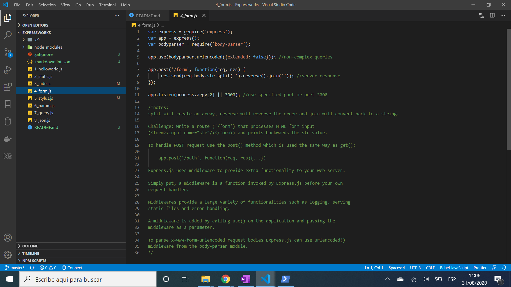

# :zap: Expressworks

* Completed exercises from freeCodeCamp to learn about Express middleware

**\* Note: to open web links in a new window use: _ctrl+click on link_**

## :page_facing_up: Table of contents

* [:zap: Expressworks](#zap-expressworks)
	* [:page_facing_up: Table of contents](#page_facing_up-table-of-contents)
	* [:books: General info](#books-general-info)
	* [:camera: Screenshots](#camera-screenshots)
	* [:signal_strength: Technologies](#signal_strength-technologies)
	* [:floppy_disk: Setup](#floppy_disk-setup)
	* [:computer: Code Examples](#computer-code-examples)
	* [:cool: Features](#cool-features)
	* [:clipboard: Status & To-Do List](#clipboard-status--to-do-list)
	* [:clap: Inspiration](#clap-inspiration)
	* [:envelope: Contact](#envelope-contact)

## :books: General info

* This is a record of the javascript solutions to the [freeCodeCamp Express Challenges](https://www.freecodecamp.org/learn/apis-and-microservices/basic-node-and-express/)
* In exercise 3 Jade is used for templating in Node.js

## :camera: Screenshots

.

## :signal_strength: Technologies

* [Express v4](https://expressjs.com/) Fast, unopinionated, minimalist web framework for Node.js
* [Jade language](https://jade-lang.com/) node templating engine

## :floppy_disk: Setup

* Setup is not applicable. These javascript files were run inside a c9 backend challenges boilerplate (FCC currently uses Repl.it for this)

## :computer: Code Examples

* extract from `8_json.js` to create a server that reads a file, parses it to JSON and outputs the content
to the user.

```javascript
app.get('/books', function(req, res){ //'/books' resource path
  var filename = process.argv[3];
  fs.readFile(filename, function(err, data){
    if (err) {
      return res.sendStatus(500);
    }
    res.json(JSON.parse(data));
  });
});
```

## :cool: Features

* Jade is much more concise than HTML

## :clipboard: Status & To-Do List

* Status: Working
* To-Do: nothing

## :clap: Inspiration

* [freeCodeCamp: Introduction to the Basic Node and Express Challenges](https://www.freecodecamp.org/learn/apis-and-microservices/basic-node-and-express/)
* [Sanjay Guruprasad: A Jade Tutorial for Beginners](https://www.sitepoint.com/jade-tutorial-for-beginners/#:~:text=Jade%20is%20an%20elegant%20templating,of%20advantages%20over%20plain%20HTML.)
* [Quora: What is Express.js? What are its advantages?](https://www.quora.com/What-is-Express-js-What-are-its-advantages)

## :envelope: Contact

* Repo created by [ABateman](https://www.andrewbateman.org) - you are welcome to [send me a message](https://andrewbateman.org/contact)
